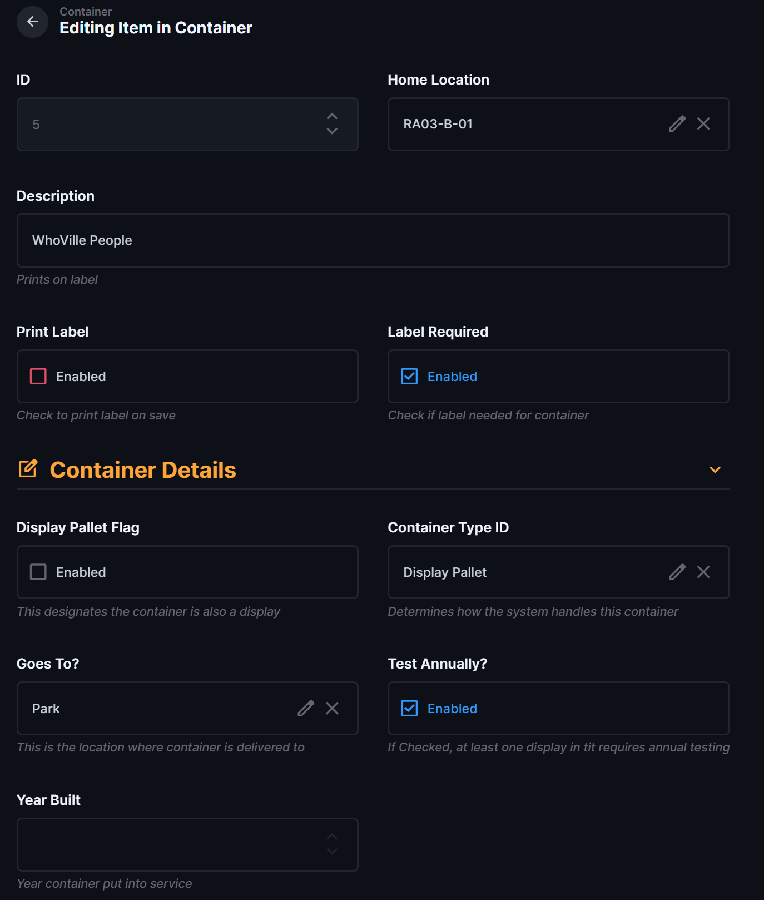
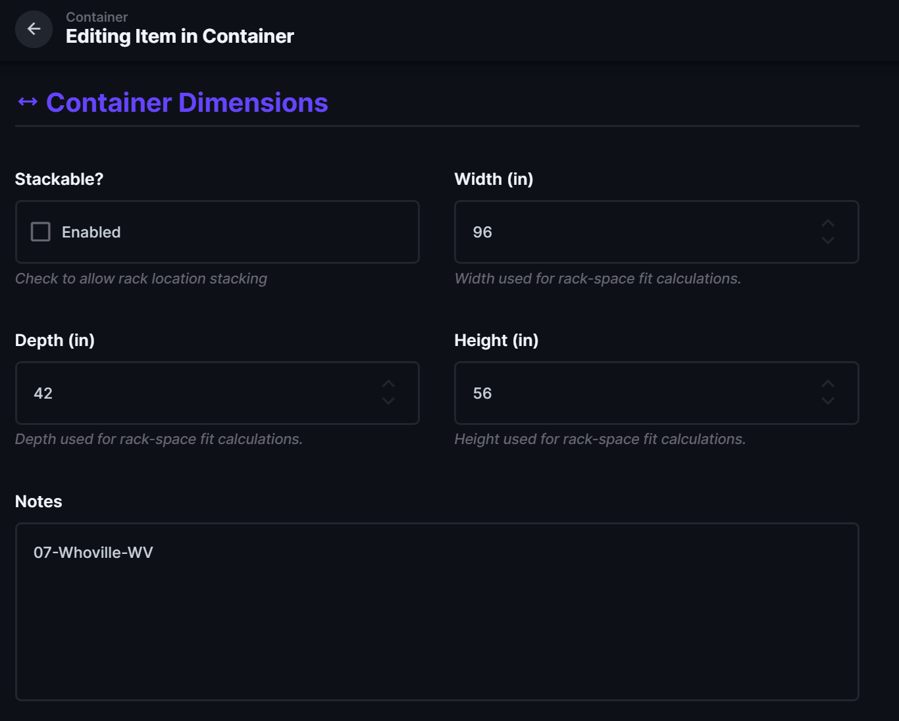

# Create or Edit a Container Record

| Document Control | Value |
|---|---|
| Document Type | Operational SOP |
| System | Production Database — Containers |
| Task | Create or edit a container record |
| Audience | Production Database operators and managers |
| Status | DRAFT |
| Owner | MSB Database Administrator |
| Last Reviewed | 2026-08-09 |
| Keywords | container, Directus, storage, home location, container type, dimensions, label, display assignment |

## Purpose

Use this procedure to create a new container or update an existing container in Directus.

Container information is used by storage, testing, rack-space planning, labeling, and display assignment workflows. Some fields affect how the system handles the container, so use the correct values rather than treating the record as simple descriptive information.

## Before You Start

Have the known container information available, including:

- container description;
- home storage location;
- container type;
- destination or **Goes To?** value when applicable;
- year built when known;
- width, depth, and height when needed;
- whether the container can be stacked;
- whether it requires annual testing;
- displays that are physically assigned to the container, if known.

If a required selection is missing, do not choose a near match. Have the correct value added or reviewed before completing the record.

## Procedure

### 1. Open the Container area

In Directus, open **Container** in the left menu.

Use **All Containers** to locate an existing container. To add a new container, use the **+** button from the Container collection.

### 2. Complete the main container information

Open the container record and complete or verify the main fields.

Fields shown greyed out in Directus are read-only and cannot be changed by the operator.

- **ID** — permanent database container number. This field is read-only in Directus.
- **Home Location** — the normal storage location for the container.
- **Description** — clear description used to identify the container. This description prints on the container label.
- **Label Required** — leave enabled when the container requires an MSB container label.
- **Print Label** — check this when you want the container labels to print when the record is saved. A container prints **2 labels** so it can be identified from either side.

Container labels can also be printed later from the **Print Container Labels** view.

### 3. Complete Container Details

In **Container Details**, complete the fields that apply to the container.

- **Display Pallet Flag** — enable only when the container itself is also a display pallet.
- **Container Type ID** — select the correct type. Container Type determines how the system handles the container and can affect storage, testing, and lifecycle behavior.
- **Goes To?** — select the normal show/site destination for the container when applicable.
- **Test Annually?** — enable when the container or at least one display on it requires annual testing.
- **Year Built** — year the container was first put into service, when known.

Container Type is an important operational field. For example, a **Standalone Display** container exists only to support a stand-alone display and can be removed when that display is retired or recycled. Do not substitute a different type simply to complete the field.

### 4. Enter the container dimensions

Open **Container Dimensions**.

Enter the dimensions in inches:

- **Width (in)** — width used for rack-space fit calculations.
- **Depth (in)** — depth used for rack-space fit calculations.
- **Height (in)** — height used for rack-space fit calculations.
- **Stackable?** — enable only when the container may be stacked in an allowed rack location.

These measurements are used to determine which available rack spaces the container can physically fit in. Enter actual container dimensions when they are known.

Use **Notes** for useful container-specific information that does not have its own field.

### 5. Assign displays to the container

Displays can be assigned from either side of the relationship:

- from a **Display** record by selecting its **Container ID**; or
- from the **Container** record by adding the displays that belong on that container.

Both methods update the same display-to-container assignment.

The database should match the physical container. Only assign displays that are actually stored on that container.

If a display is already assigned to another container, verify the physical location before changing the assignment.

### 6. Save the container

Review the information and save the record.

If **Print Label** is checked, **2 container labels** will print when the record is saved.

## Expected Result

The container record should now have the correct:

- permanent container ID;
- home location;
- description;
- container type and operational settings;
- dimensions used for rack-space planning;
- display assignments when known;
- label status.

The Production Database should match the physical container and its contents.

## If Something Is Wrong

### The correct Home Location is missing

Do not select a different location just to complete the field. Have the correct storage location added or reviewed.

### The correct Container Type is missing

Do not choose a similar type. Container Type can affect system behavior. Have the correct type added or reviewed.

### A display is not available to assign

Do not create a duplicate display in Directus. Display records are created through the LOR/LOR2DB process. Verify that the display has been imported into the Production Database.

### A display is assigned to the wrong container

Correct the assignment from either the Container record or the Display record. Both screens update the same relationship.

### The label does not print

If the record saved correctly but the label did not print, use the container label-printing procedure for reprinting or troubleshooting.

## Related Documents

- [Container Operational SOPs](README.md)
- [Production Database Operational SOPs](../README.md)
- [Complete Display Metadata After LOR Import](../Displays/Complete_Display_Metadata_After_LOR_Import.md)
- [Label Printing](../Label_Printing/)
- [Containers and Storage Engineering Handoff](../../01_System_Architecture/04_Containers_and_Storage/README.md)
