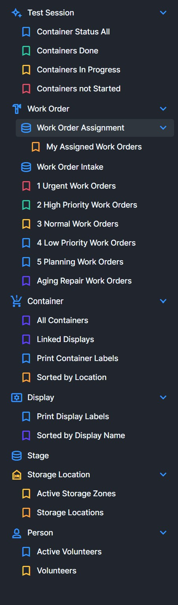
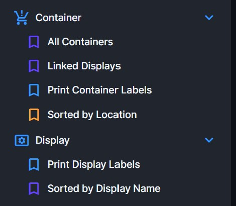
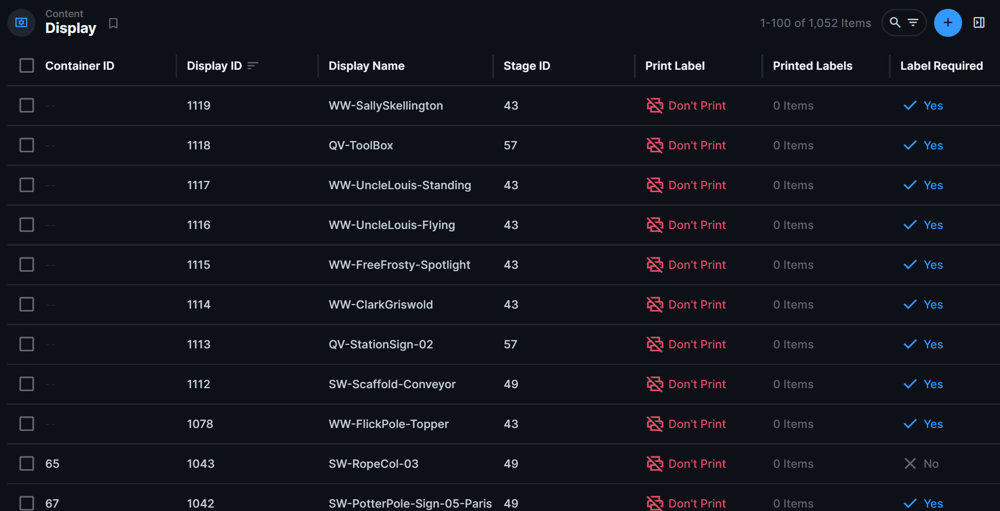
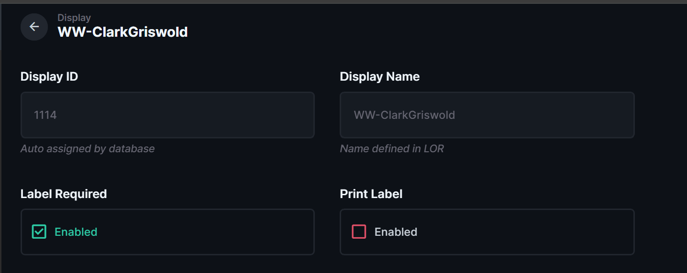
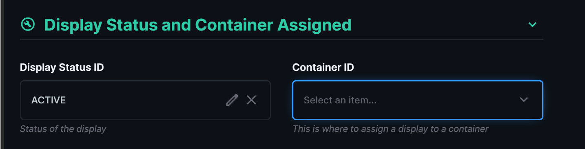
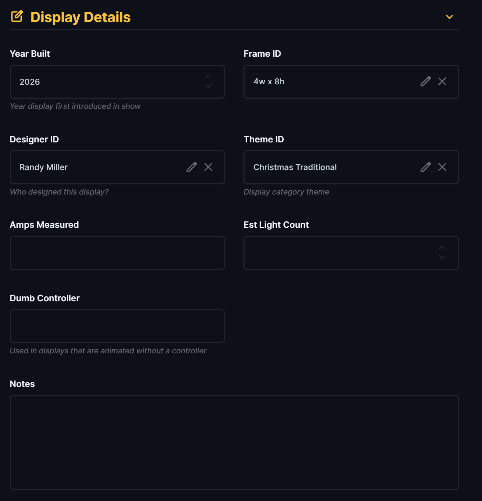

# Complete Display Metadata After LOR Import

| Document Control | Value |
|---|---|
| Document Type | Operational SOP |
| System | Production Database — Displays |
| Task | Complete Production Database metadata for a display after LOR/LOR2DB ingest |
| Audience | Production Database operators and managers |
| Status | DRAFT |
| Owner | MSB Database Administrator |
| Last Reviewed | 2026-08-09 |
| Keywords | display metadata, new display, LOR ingest, Directus, year built, frame, designer, theme, container |

## Purpose

Use this procedure after a new display has been created in LOR and successfully imported into the Production Database through LOR2DB.

LOR and LOR2DB create the database identity and LOR-derived information. This procedure adds the additional display information that is maintained in the Production Database rather than in LOR.

## Before You Start

Before completing the display information:

- The new display must already exist in LOR.
- The normal LOR2DB import/reconciliation process must already have created the display in the Production Database.
- You must have permission to edit Display records in Directus.
- Have the known physical/production information for the display available, such as year built, frame type, designer, theme, and container assignment.

Display creation is disabled in Directus. New Display records enter the Production Database through the LOR/LOR2DB process.

## Procedure

### 1. Open the Display area

In Directus, locate the **Display** section in the left menu.

The Display section currently includes operator bookmarks such as **Print Display Labels** and **Sorted by Display Name**.

Open **Sorted by Display Name** or the Display collection so you can locate the new display.

### 2. Find the new display

Use the search control in the upper-right corner of the Display list to search for the new display by name or ID.

By default, containers are not assigned in Light-O-Rama, so newly imported displays normally have a blank **Container ID** until one is assigned in the Production Database.

Open the correct display record.

### 3. Verify the imported identity fields

At the top of the display record, verify:

- **Display ID** — assigned automatically by the Production Database.
- **Display Name** — comes from the LOR source data.

**Display ID** and **Display Name** are read-only in Directus. Display Name changes must be made in the Light-O-Rama Preview Editor and then brought into the Production Database through the normal LOR2DB process.

Also verify the label controls:

- **Label Required** should normally remain enabled for a new physical display that requires an MSB display label.
- **Print Label** may be used as the final step of this procedure. If **Print Label** is checked when the record is saved, one display label will print automatically.
- A display label can also be printed from the Display search/list screen by selecting the display and choosing **Print Label**.

### 4. Confirm status and container assignment

Open **Display Status and Container Assigned**.

For a new display that is part of the current show:

1. Confirm **Display Status ID** is **ACTIVE**.
2. Set **Container ID** to the container where the display is physically stored, if the correct container is known. A window will appear on the right side of the screen where you can search for and select the container.

If the correct container does not exist yet, stop and create or edit the container using the Container procedure before assigning the display. Do not assign a different container just to complete this field.

### 5. Complete Display Details

Open **Display Details** and enter the known Production Database information.

Complete the applicable fields:

- **Year Built** — year the display was first introduced into the show.
- **Frame ID** — select the correct physical frame type.
- **Designer ID** — select the person who designed the display. The person must already exist in `ref.person` before they can be selected here.
- **Theme ID** — select the appropriate display theme/category.
- **Amps Measured** — enter when a measured value is available.
- **Est Light Count** — enter the estimated light count for the display. This value is used to calculate the current light count for active displays in the show.
- **Dumb Controller** — complete only when applicable to a display animated without a normal controller or when a dumb controller is used for an added special effect, such as Woodstock.
- **Notes** — add useful Production Database information that is not available in LOR fields.

If a required **Frame ID** or **Theme ID** option does not exist, do not substitute a near match. Have the missing option added by the database administrator or responsible manager.

If the correct **Designer ID** does not appear, the person must first be added to `ref.person` through the normal People/Identity process.

### 6. Save the display record and print the label

Review the record for obvious errors, then save it in Directus.

If **Print Label** is checked, one display label will print automatically when the record is saved.

You can also print the label later from the Display search/list screen by selecting the display and choosing **Print Label**.

## Expected Result

The new display should now have:

- its permanent database-assigned Display ID;
- its LOR-defined Display Name;
- ACTIVE status when appropriate;
- the correct container assignment;
- the available year, frame, designer, theme, electrical/light-count, controller, and notes information completed;
- Label Required set appropriately;
- its display label printed when needed.

The display is now ready for the next applicable operational tasks, such as container testing or later setup work.

## If Something Is Wrong

### The display is not in Directus

Display creation is disabled in Directus. Do not attempt to create the display there.

Verify that the normal LOR2DB import/reconciliation process has completed successfully for the LOR source containing the display.

### The Display Name is wrong

The source name **must** be corrected through the responsible LOR/LOR2DB process so the authoritative LOR source and Production Database remain aligned.

### The correct container is not listed

Do not choose a different container just to complete the field.

Use the Container creation/editing procedure to add or correct the container first, then return to this display and assign it.

### The Designer is not listed

**Designer ID** comes from `ref.person`. The person must exist there before they can be selected on the Display record.

Use the normal People/Identity process to add the person, then return to this display.

### A Frame or Theme value is missing

Do not use a near match. Ask the database administrator or responsible manager to add the missing selection option.

## Related Documents

- [Display Operational SOPs](README.md)
- [Production Database Operational SOPs](../README.md)
- [Label Printing](../Label_Printing/)
- [LOR2DB Ingest Engineering Handoff](../../01_System_Architecture/02_LOR2DB_Ingest/README.md)
- [People and Identity Engineering Handoff](../../01_System_Architecture/03_People_and_Identity/README.md)
- [Containers and Storage Engineering Handoff](../../01_System_Architecture/04_Containers_and_Storage/README.md)
