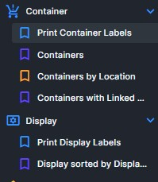
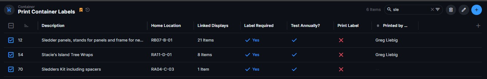
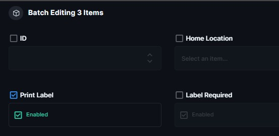

# Print Display or Container Labels

[↑ Label Printing Home](README.md) | [Next: If Label Printing Does Not Start →](If_Label_Printing_Does_Not_Start.md)

| Document Control | Value |
|---|---|
| Document Type | Operational SOP |
| System | Production Database — Label Printing |
| Task | Print display or container labels |
| Audience | Volunteers / Managers |
| Status | CURRENT |
| Owner | Production Database Manager |
| Last Reviewed | 2026-08-09 |
| Keywords | labels, display, container, print label, batch printing |

## Purpose

Use this procedure to print labels for Display or Container records from the Production Database.

## Open Label Printing

Use the Directus left navigation panel.

For Display labels, open:

**Display -> Print Display Labels**

For Container labels, open:

**Container -> Print Container Labels**

## Print Multiple Labels

1. Find the Display or Container records you want to print.

You can search by name, description, location, or another useful field shown in the list.

2. Select the records using the checkbox column.

3. Select the pencil icon in the upper-right corner to open the batch editor.

4. Set **Print Label** to **Enabled**.

5. Save the changes.

## What Happens Next

After saving:

1. the label request is queued automatically;
2. the LabelPrintService creates the print batch;
3. the labels print at the label printer; and
4. the Print Label flag resets automatically after processing.

No additional database action is required when printing succeeds.

## Label Quantities

- **Display:** one label per display.
- **Container:** two labels per container.

## Expected Result

The requested labels print and the Print Label request resets after processing.

## If Something Is Wrong

Do not repeatedly submit the same print request if labels do not start printing.

Use [If Label Printing Does Not Start](If_Label_Printing_Does_Not_Start.md).

## Related Documents

- [If Label Printing Does Not Start](If_Label_Printing_Does_Not_Start.md)
- [Label Printing Home](README.md)

---

[↑ Label Printing Home](README.md) | [Next: If Label Printing Does Not Start →](If_Label_Printing_Does_Not_Start.md)
