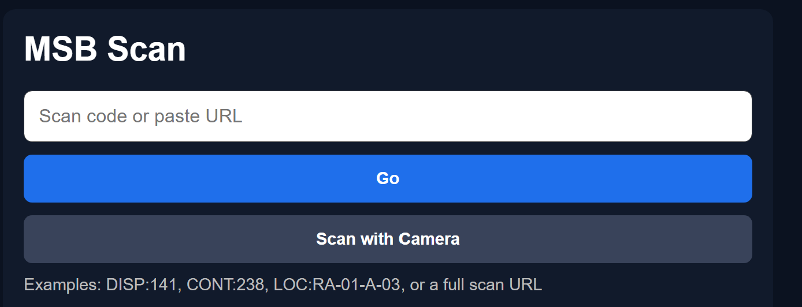

# Use Scan Manually

| Document Control | Value |
|---|---|
| Document Type | Operational SOP |
| System | Production Database — Scan |
| Task | Enter an MSB scan code manually |
| Audience | MSB volunteers and operators |
| Status | DRAFT — operator review and screenshots required |
| Owner | MSB Database Administrator |
| Last Reviewed | 2026-08-24 |
| Keywords | manual scan, enter code, paste URL, DISP, CONT, scan without camera |

## Purpose

Use this procedure when you know the MSB code or have a scan URL but do not want to use the camera.

Manual entry and camera scanning use the same item identity. Entering `DISP:141` should identify the same Display as scanning its QR code.

## Before You Start

Open:

**https://db.sheboyganlights.org/scan/**

You should see:

- **MSB Scan**;
- a box labeled **Scan code or paste URL**;
- a **Go** button; and
- a **Scan with Camera** button.



## Procedure

### 1. Click or tap the entry box

Select **Scan code or paste URL**.

### 2. Enter the code

Enter the code exactly as shown on the label or in the information you were given.

Current examples include:

```text
DISP:141
CONT:238
```

You may also paste a full MSB scan URL.

### 3. Press Go

Press **Go**.

Scan will open the landing page for the item type and identifier you entered when that route is currently supported.

### 4. Choose what you need to do

For a Display, use [What To Do After You Scan](What_To_Do_After_You_Scan.md) to choose the correct action.

For a Container, the current Scan page provides **Open Container Record** and **Back to Scan**.

## Expected Result

The system opens the correct item or task page for the code you entered.

## If Something Is Wrong

### You see “Unrecognized scan format”

Check that the code includes both the type and the key, separated by a colon.

For example:

```text
DISP:141
```

Do not enter only `141`.

### The item cannot be found

Check the label or code and try again. Do not guess a different ID.

### A code type does not open a useful page

Some approved MSB identity types exist before their complete operator Scan workflow is deployed. See [QR Code Types and Meanings](QR_Code_Types_and_Meanings.md).

## Related Documents

- [MSB Scan — Operator Guide](README.md)
- [QR Code Types and Meanings](QR_Code_Types_and_Meanings.md)
- [What To Do After You Scan](What_To_Do_After_You_Scan.md)
