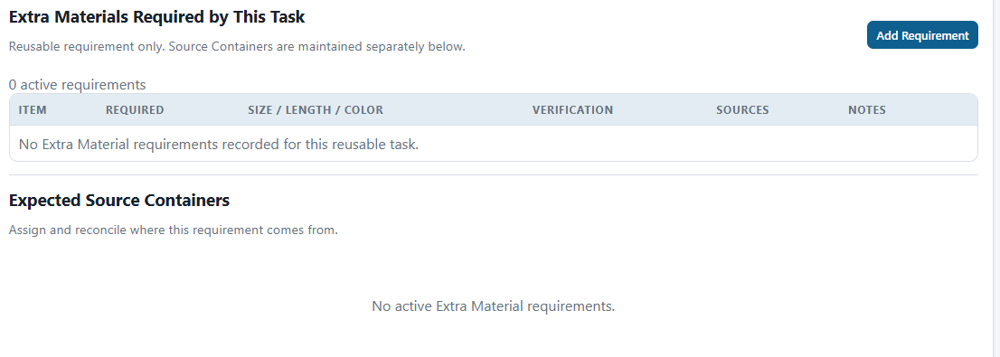

# Setup Manager Review Guide

| Document Control | Value |
|---|---|
| Document Type | Operator / Manager Procedure |
| System | Production Database — Setup Session |
| Audience | Setup Managers and reviewers |
| Status | CURRENT |
| Owner | MSB Production Database / Setup administrator |
| Last Reviewed | 2026-09-25 |
| Keywords | Setup, reusable task, Verification Queue, Copy Task, prerequisites, Display Ownership, Extra Materials, Kit Inventory |

## Purpose

Use this guide while reviewing and correcting Setup tasks.

It explains the normal, fastest way to do the work. You should not need engineering or database knowledge to use this guide.

## Open Setup

[**Open the Setup application**](https://my.sheboyganlights.org/setup/)

For current annual work, use the live **2026 Setup Session** and open **Plan / Schedule**. Use **2025 — Historical Verification** only when you intentionally need historical/review evidence. **This is real Production data** and remains permanently year-bounded to the 2025 historical review; do not treat it as the current 2026 schedule.

## 1. Schedule 2026 Work

Open **Plan / Schedule** for the live 2026 Session.

- The Task Finder secondary filters start minimized; use **More filters** when you need the additional status/time/crew/effort controls.
- Click **+ Add Work Days** only when dates need to be added. The calendar stays collapsed otherwise so the Scheduling Board keeps its working space.
- In the calendar, tap/click a date to select it and tap/click it again to deselect it. No Ctrl/Shift is required.
- Dates that already exist as Work Days are disabled and cannot be selected.
- Submit the selected dates together.
- Use the Day-view controls to show scheduled/unfinished, completed/cancelled, or empty days as needed.
- A cancelled/rainout day is retained as annual/history context; do not treat cancellation as permission to delete history.
- Schedule and move annual work with the existing board controls. Season-only 2026 work remains annual unless a Manager explicitly promotes durable knowledge through the appropriate reusable workflow.

The Scheduling Board does not define the #206 Pick List/material-demand workflow.

## 2. Find Work That Still Needs Review

1. Open the **Verification Queue**.
2. Choose **Unverified** from the review-status dropdown.
3. Open one task.
4. Review and correct the reusable information.
5. When the task is complete and correct, click **Mark Verified**.

Before Mark Verified, check:

- Should this task exist every year?
- Is **Active Reusable Task** correct? If normal yearly work is inactive, it will not be included when a future Setup Session is created.
- Is the normal crew size entered?
- Is the expected time entered?
- Are the prerequisites correct?
- Are the needed Displays assigned to the correct task?
- Are the needed Kit Boxes assigned?
- Are Extra Materials complete enough for planning?
- Are Equipment / Resources complete enough for planning?
- Are the important notes and procedure correct?

If a reusable task was created after 2025 and is not part of the 2025 historical Session, review the reusable task but do not invent 2025 history just to make **Mark Verified** available.

*Use the **Unverified** filter to find unfinished review work. The marked button is **Mark Verified**.*

## 3. Edit a Reusable Task

A reusable task describes work that normally comes back in future Setup seasons.

Use it for normal, repeatable Setup work.

Do not create one task for every Display just to make the inventory easier to organize.

### Important planning fields

- **Crew min / Crew max** — normal crew size for this work.
- **Expected hrs / Expected mins** — normal time the task usually takes.
- **Completion point** — **Done when.** What must be true before the Captain can call the task finished?
- **Readiness note** — **Can start when.** What must happen before this task can begin?
- **Weather note** — **Weather limits.** What weather can delay or stop the task?
- **Reusable notes** — **Important setup notes.** Keep useful year-to-year warnings, gotchas, and crew knowledge here.

Examples:

- Readiness: `Wait until grass cutting is complete before laying cords.`
- Weather: `Do not use the high lift when wind is over 10 mph.`
- Completion point: `Cords are plugged in and tested.`
- Reusable notes: `Install the Racing Arch harness before the arches. Start with the Y at the outbound end.`

Old copy/reconstruction history is not useful Captain information. Clean it out when the lasting instruction is known.

*The four planning/note fields have different jobs. In particular, **Readiness note** is used for planning when the task can start.*

### Active Reusable Task

*If this is normal yearly Setup work, **Active Reusable Task** must be checked so it can be included in a future Setup Session.*

## 4. Copy a Similar Task

Use **Copy** / **Copy Task** when a new task is similar to one that already exists.

After copying:

1. Open the new task.
2. Change the task name and Stage/Scene if needed.
3. Review crew and expected time.
4. Review Completion point, Readiness, Weather, and Reusable notes.
5. Review Resources, Displays, Kits, and Extra Materials.
6. Add the correct prerequisites.

Treat the copy as a starting point, not a finished task.

## 5. Change Task Order

To change the normal order, **drag the task to where it belongs**.

**Do not renumber every task by hand.**

Normal drag moves/reorders the task.

If the up/down controls are easier for a small adjustment, those may also be used.

## 6. Add a Prerequisite

A prerequisite is a task that must happen before another task can start.

Fast method:

1. Hold **Shift** before pressing the mouse button.
2. Start with the **later task**.
3. Drag it onto the **task that must happen first**.
4. Release.

Remember:

**Normal drag = move/reorder a task.**  
**Shift-drag = add a prerequisite.**

You can also use the prerequisite controls in task detail when that is easier.

## 7. Assign Displays to the Correct Task

Use **Uses Display / Container Material** when the task needs current Displays for its Stage or Scene.

If only one Setup Task in that Stage/Scene works with the Displays, Setup normally handles the Displays automatically.

If more than one Setup Task works with Displays in the same Stage or Scene, open **Display Ownership**.

The question is:

> Which Setup Task is responsible for each Display?

### Select several Displays

- Click one Display to select it.
- Hold **Ctrl** on Windows or **Cmd** on a Mac and click to add/remove individual Displays.
- Hold **Shift** and click to select a range in the same task column.
- Drag any selected Display to the correct task. The selected group moves together.
- On a large list, choose the task under **Move selected to** and click **Move selected**.

### Unassign a Display

If a Display was assigned to the wrong Setup Task, **right-click the assigned Display card and choose/confirm Unassign**.

Unassign removes only the Setup ownership row. It does not change LOR membership, Display status, or the Display's Container.

A current LOR Display that is unassigned will immediately show as **Missing owner** until it is assigned to the correct Setup Task.

When the screen says **Coverage complete**, every Display in that review has a task.

Display Ownership only tells Setup which task is responsible. It does not move the Display to another Container or change its LOR Stage/Scene.

## 8. Equipment / Resources

Use **Equipment / Resources** for reusable tools, equipment, vehicles, and similar things needed to do the work.

Examples:

- pliers;
- adjustable wrenches;
- lifts;
- ToolCat.

Search for an existing resource before creating a new one.

Use **Manage Resource Catalog** only when the resource itself needs to be added or corrected.

## 9. Extra Materials Required by This Task

Use **Extra Materials Required by This Task** for materials the job needs.

Examples:

- T-Posts;
- spacers;
- bungees;
- stakes;
- bases.

Correct quantity, size, length, color, or notes when you know them.

If you do not know, do not guess.

### Where the material comes from

**Expected Source Containers** tell the crew where the material should normally be found.

Keep these separate:

- **Extra Material requirement** = what the task needs.
- **Expected Source Container** = where the crew should expect to find it.

A task can require T-Posts even when the posts come from shared stock instead of a Kit.

*Think of these as two questions: **What does this task need?** and **Where should the crew expect to find it?***

## 10. Kit Boxes

Use **Kit Boxes** on the task to choose the physical Kit that supports the work.

A Kit may support more than one task.

Do not assign bulk T-Post or bulk spacer stock as a Kit just because material comes from that Container.

## 11. Kit Inventory

Open:

[**Open Kit Inventory**](https://my.sheboyganlights.org/setup/kit-inventory/)

Use Kit Inventory to review what should normally be in each physical Kit.

### Expected vs On Hand

- **Expected** = what should normally be in the Kit.
- **On Hand** = what somebody physically counted.

**Do not enter an Expected quantity as On Hand unless somebody actually counted it.**

### Unverified Items / Remainders

Use **Unverified Items / Remainders** for information that is still unclear.

Do not guess where something belongs just to make the record look complete.

The current goal is **review and correction**, not a complete warehouse inventory.

## 12. T-Post Inventory

Open:

[**Open T-Post Inventory**](https://my.sheboyganlights.org/setup/t-post-inventory/)

T-Post Inventory is separate from Kit Inventory.

It separates shared/bulk T-Post stock from T-Posts intentionally stored with a Kit or Display.

Use **Count physical stock** only when somebody actually counts or adjusts stock.

Do not use a planning quantity as a physical count.

## 13. Spacers

Shared/bulk spacer stock remains separate from Kit contents.

Some Kits legitimately contain fitted/custom spacers for that task. Do not assume every spacer belongs in the bulk spacer Containers.

## 14. Procedures

When Setup shows a current published Setup procedure, review it when the task instructions may have changed.

If the procedure is wrong or incomplete, correct the responsible source/published instruction through the established procedure workflow rather than hiding the correction only in a task note.

## 15. Saving and Moving Between Tasks

If Setup warns that you have unsaved changes, choose the option that matches what you intend:

- **Save** — keep the change.
- **Discard** — throw away the unsaved change.
- **Stay** — remain on the task and keep editing.

Do not click through a warning without reading it.

## 16. Run the Material Audit

Use **Material Audit** to review reusable Setup completeness and material relationships. The real 2026 Session is already live; the audit remains useful for correcting durable reusable information.

The audit checks for missing Setup information. It does not decide whether a task or assignment is correct.

### Future Session Readiness

If a reusable task is inactive, it will not be included when a future Setup Session is created.

Review inactive tasks and decide whether that is intentional.

### Display / LOR Ownership

If Displays are not assigned to a Setup Task where assignment is needed, use the audit correction action to open **Display Ownership**.

You may need to:

- assign the Displays to an existing task;
- create a missing practical Setup Task; or
- correct an earlier task decision.

Use **Ctrl/Cmd-click**, **Shift-click**, and group movement so you do not move Displays one at a time.

### Kit Assignment Coverage

If a Kit/support Container is not assigned, decide why.

- If one or more Setup Tasks need it, assign the Container to the correct task(s).
- If it is intentionally shared/bulk stock, use the audit review action to record that reason.
- Do not invent a task assignment just to clear the audit.

## 17. If Something Does Not Make Sense

Do not work around bad information.

If a task, Display assignment, Kit, Extra Material, T-Post source, spacer source, resource, or procedure clearly does not make sense, stop and flag it for review.

Unknown is better than a confident guess that becomes bad planning information.

## Current Goal

The real 2026 Setup Session is live. Use it for annual scheduling/execution while continuing to correct reusable knowledge when durable year-to-year information is learned. Keep 2026-only planning separate from the reusable Catalog, and keep Pick List/material-demand work in its owning workflow.

## Related Operator Instructions

- [Setup and Deployment](../../01_System_Architecture/12_Setup_and_Deployment/README.md)
- [Review and Correct the 2025 Setup History](../../01_System_Architecture/12_Setup_and_Deployment/operatorSOP/Review_2025_Setup_History.md)
- [Setup Operator Procedure Index](../../01_System_Architecture/12_Setup_and_Deployment/operatorSOP/README.md)
