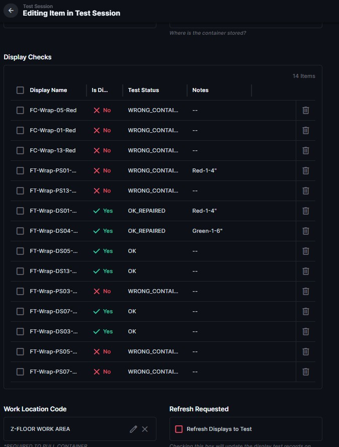

# Handle a Wrong or Missing Display

[← Previous: Display Test Status Reference](Display_Test_Status_Reference.md) | [↑ Test Sessions Home](README.md) | [Next: Refresh Displays to Test →](Refresh_Displays_to_Test.md)

| Document Control | Value |
|---|---|
| Document Type | Operational SOP |
| System | Production Database — Testing |
| Task | Correct a wrong or missing display during testing |
| Audience | Testing volunteers / managers |
| Status | DRAFT |
| Owner | Production Database Manager |
| Last Reviewed | 2026-08-09 |
| Keywords | wrong container, missing display, container assignment, testing |

## Purpose

Use this procedure when the displays shown in a test session do not match what is physically on the container.

## Before You Start

Determine which condition is true:

- a listed display is not actually on this container;
- a display that belongs on this container is missing from Display Checks; or
- a display has been moved and its current container assignment is wrong in the Production Database.

## Procedure

1. Verify where the display is physically located.
2. Correct the display's container assignment so the Production Database matches the physical container.
3. For an incorrect Display Check, mark the display as not present and use the current **Wrong Container** testing result.

4. Do not create a repair Work Order just because the display is assigned to the wrong container.
5. Save the display test record.
6. Use [Refresh Displays to Test](Refresh_Displays_to_Test.md) to synchronize the test session with the corrected container assignments.

## Expected Result

The Production Database container assignment matches the physical location, and the test session can be refreshed to show the correct displays.

## If Something Is Wrong

If an existing Work Order prevents a stale test record from being removed, stop and ask a manager for help. Do not delete testing or Work Order history manually.

## Related Documents

- [Refresh Displays to Test](Refresh_Displays_to_Test.md)
- [Test the Displays on a Container](Test_the_Displays_on_a_Container.md)

---

[← Previous: Display Test Status Reference](Display_Test_Status_Reference.md) | [↑ Test Sessions Home](README.md) | [Next: Refresh Displays to Test →](Refresh_Displays_to_Test.md)
