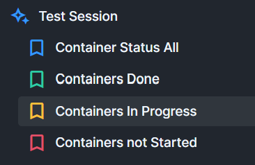
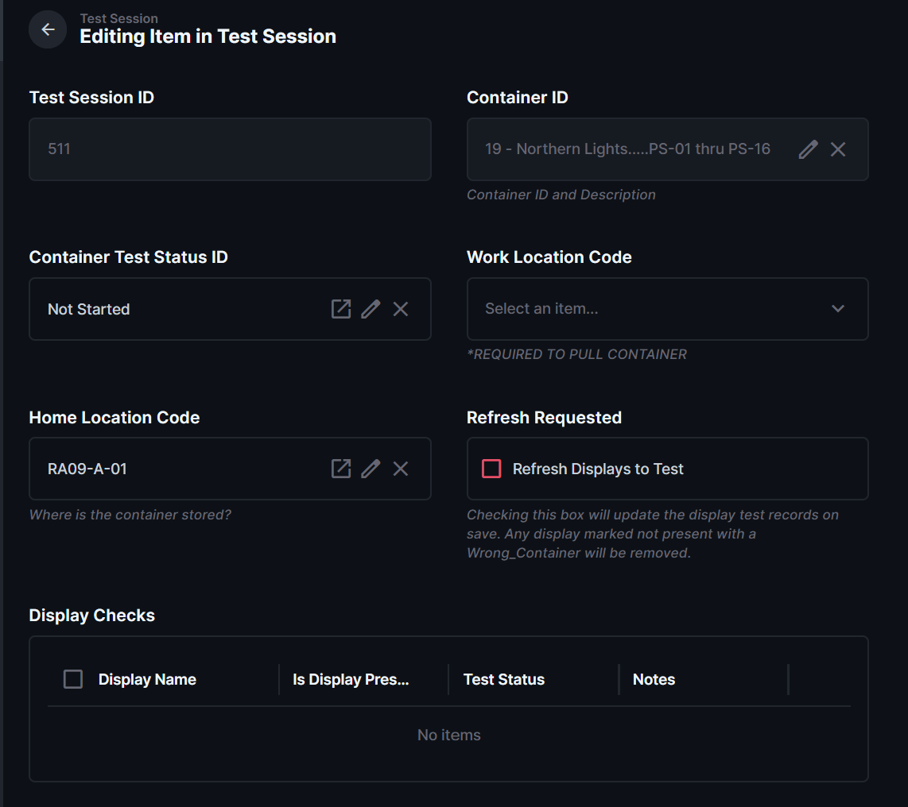

# Start a Container Test Session

[↑ Test Sessions Home](README.md) | [Next: Test the Displays on a Container →](Test_the_Displays_on_a_Container.md)

| Document Control | Value |
|---|---|
| Document Type | Operational SOP |
| System | Production Database — Testing |
| Task | Start testing a container |
| Audience | Testing volunteers / forklift operators |
| Status | DRAFT |
| Owner | Production Database Manager |
| Last Reviewed | 2026-08-09 |
| Keywords | testing, container, test session, in progress, work location |

## Purpose

Use this procedure when a container is pulled from storage and testing is ready to begin.

## Before You Start

- The container has been physically pulled from its Home Location.
- The container is in the work area where testing will occur.
- You are signed in to the Production Database.

## Procedure

1. Open **Containers Not Started**.

2. Find the container you are testing.
   - Search by container number, or
   - search using part of the container description.
3. Open the container test-session record.

4. Change **Container Test Status ID** to **In Progress**.
5. Select the correct **Work Location**. This cannot be blank.
6. Save the record.

After saving, the system looks up the displays assigned to the container and creates the display testing records.

## Expected Result

- The container is now **In Progress**.
- It no longer appears in **Containers Not Started**.
- It appears in **Containers In Progress**.
- **Display Checks** are available for the displays assigned to the container.

Do not begin recording display test results until the Display Checks have been created.

## If Something Is Wrong

If no Display Checks appear after saving, stop and ask a manager for help before continuing.

## Related Documents

- [Test the Displays on a Container](Test_the_Displays_on_a_Container.md)
- [Resume an In-Progress Container](Resume_an_In_Progress_Container.md)

---

[↑ Test Sessions Home](README.md) | [Next: Test the Displays on a Container →](Test_the_Displays_on_a_Container.md)
