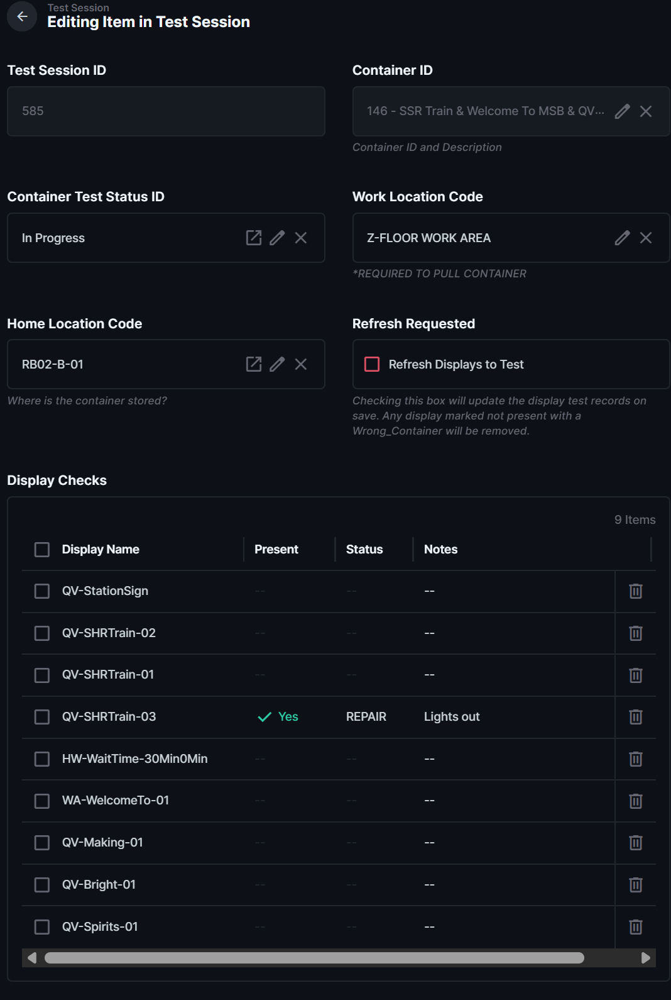

# Test the Displays on a Container

| Document Control | Value |
|---|---|
| Document Type | Operational SOP |
| System | Production Database — Testing |
| Task | Test displays assigned to a container |
| Audience | Testing volunteers |
| Status | DRAFT |
| Owner | Production Database Manager |
| Last Reviewed | 2026-08-09 |
| Keywords | testing, display checks, container, display test |

## Purpose

Use this procedure after a container test session has been started and its Display Checks have been created.

## Before You Start

- The container test session is **In Progress**.
- The container is at the correct Work Location.
- Display Checks are visible in the test-session record.

## Procedure

1. Open **Containers In Progress**.
2. Find and open the container you are testing.

3. Scroll to **Display Checks**.
4. Open one display test record.
5. Confirm whether the display is physically present on the container.
6. Test the display.
7. Select the correct test result.
8. Add notes when required or when they will help explain what was found.
9. Update amps or light count if needed.
10. Save the display test record.
11. Repeat for every display on the container.

## Common Results

The current testing workflow uses results for displays that are:

- OK
- repaired during testing
- in need of a repair Work Order
- deferred
- assigned to the wrong container

The exact screen vocabulary is being audited. Use the labels currently shown in Directus.

## Expected Result

Every display shown in Display Checks has been physically checked and has an accurate test result.

## If Something Is Wrong

- If a display listed in Display Checks does not belong on this container, do not create a repair Work Order for that mismatch. Use [Handle a Wrong or Missing Display](Handle_a_Wrong_or_Missing_Display.md).
- If a display needs repair beyond what can be completed immediately, use [Handle a Display That Needs Repair](Handle_a_Display_That_Needs_Repair.md).
- If testing must be intentionally paused, use [Defer Testing](Defer_Testing.md).

## Related Documents

- [Start a Container Test Session](Start_a_Container_Test_Session.md)
- [Display Test Status Reference](Display_Test_Status_Reference.md)
- [Finish a Container Test Session](Finish_a_Container_Test_Session.md)
