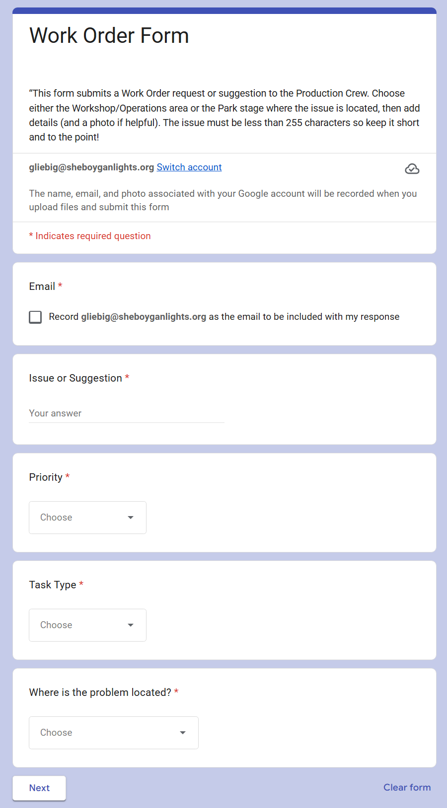
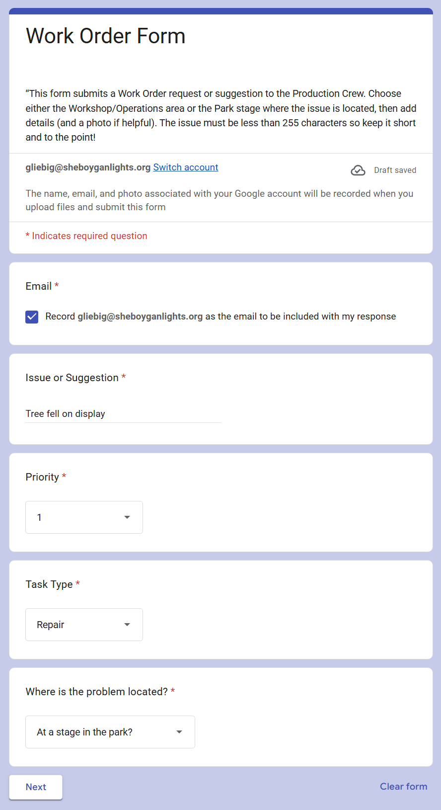
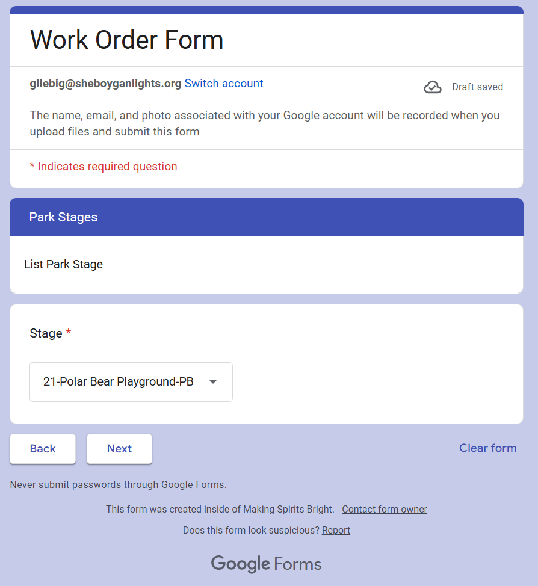
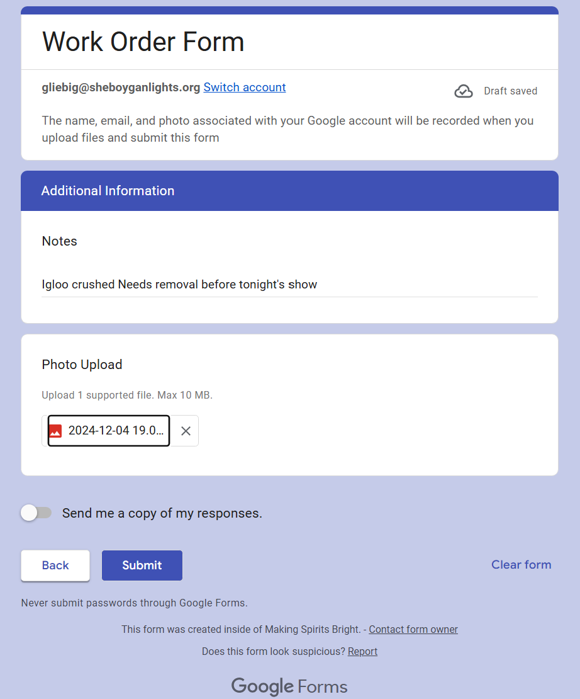
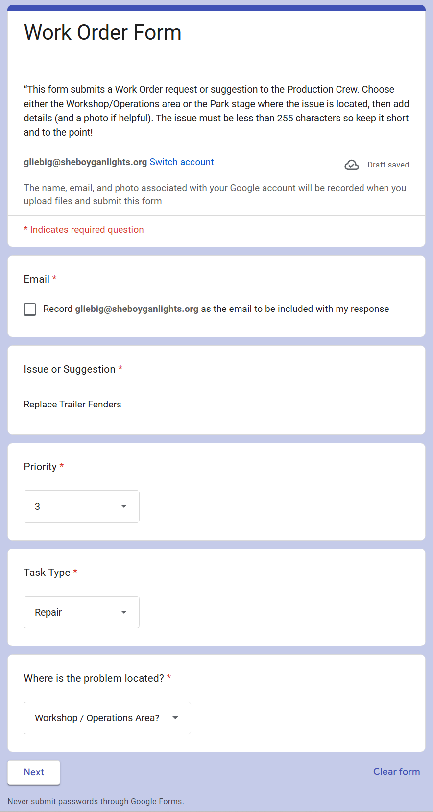
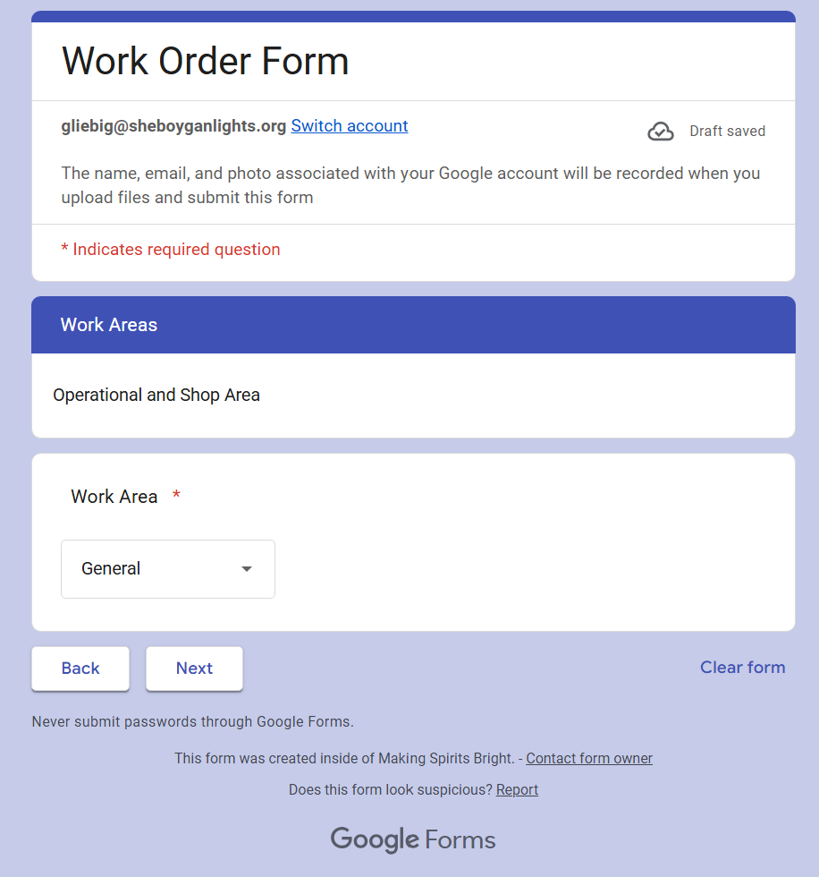
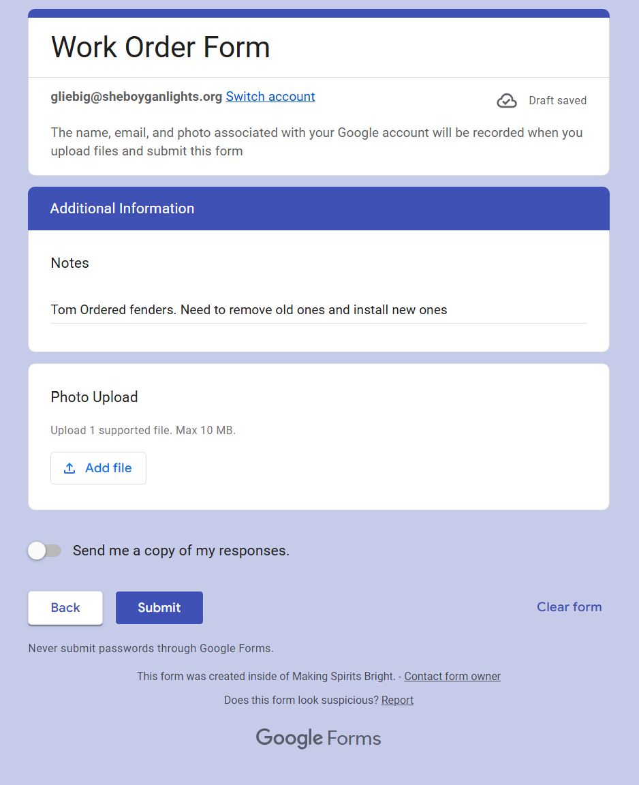

# Submit a Work Order Request

[↑ Work Orders Home](README.md) | [Next: Triage a Work Order Request →](Triage_a_Work_Order_Request.md)

| Document Control | Value |
|---|---|
| Document Type | Operational SOP |
| System | Production Database — Work Orders |
| Task | Report a problem or request work |
| Audience | Everyone — public-facing |
| Status | CURRENT |
| Owner | Production Database Manager |
| Last Reviewed | 2026-08-09 |
| Keywords | work order request, report problem, intake, Google Form, park, workshop |

## Purpose

Use this procedure when you need to report a problem or request work.

The **Work Order Request** is available from the top of `my.sheboyganlights.org` and may be used by anyone. You do not need access to the Production Database or Directus to submit a request.

Submitting the form creates a **Work Order Intake** record for manager review. It does not create an active Work Order until a manager reviews and promotes it.

> **Testing exception:** If a display Test Session already generated a repair Work Order automatically, do not submit another Work Order Request for the same repair.

## Start the Request

1. Open `my.sheboyganlights.org`.
2. Select **Work Order Request**.
3. Complete the first page of the form.
4. Choose whether the request is for the **Park** or the **Workshop**.

Continue with the section below that matches the location of the work.

## Park Request

Use the **Park** path when the work is associated with the show site or a park location.

1. Complete the Park information requested on the form.

2. Continue to the next Park page and provide the requested location and problem details.

3. Review the final Park page, add any remaining information, and submit the request.

## Workshop Request

Use the **Workshop** path when the work is associated with the workshop, storage, office, equipment, or another non-park work area.

1. Complete the Workshop information requested on the form.

2. Continue to the next Workshop page and provide the requested work-area and problem details.

3. Review the final Workshop page, add any remaining information, and submit the request.

## Priority Reference

The form currently shows Priority as a number. Use the following reference when choosing the best estimate:

| Priority | Meaning |
|---|---|
| **1** | Immediate / Critical |
| **2** | High |
| **3** | Normal |
| **4** | Low |
| **5** | Planning |

The number on the request is an **intake priority**. A manager reviews it during triage and may correct the urgency before the request becomes an active Work Order.

## Expected Result

After the form is submitted:

- the request is stored in **Work Order Intake**;
- managers can review and triage it; and
- if approved, the request is promoted into an active Work Order that can be assigned and completed.

You do not need to create another request after submitting unless you are reporting a separate problem.

## Related Documents

The remaining Work Order procedures are for internal MSB operations:

- [Triage a Work Order Request](Triage_a_Work_Order_Request.md)
- [Work Orders Home](README.md)

---

[↑ Work Orders Home](README.md) | [Next: Triage a Work Order Request →](Triage_a_Work_Order_Request.md)
