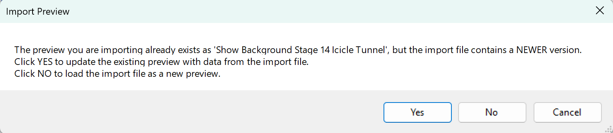
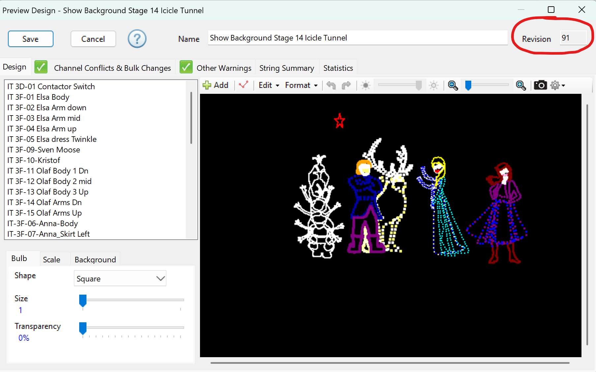

# Preview Import Workflow

All current **show previews** are stored in:

⚠️ At this time, there is **no automatic sync** between your local LOR system and this shared folder. Each user must ensure they are working with the **current version**.
  
---

## Step 1 – Check the Current Manifest
Before importing, open or print the manifest file:

This lists all previews, their names, and revision numbers.

---

## Step 2 – Import a Preview
When you import a `.lorprev` file, LOR will prompt you depending on whether your system already has that preview:

- **Case A – Same Version (No Update Needed)**  
  You’ll see a message like this:  
  
  ➡️ If the version matches, no action is needed. Click **Cancel** to avoid creating duplicates.

- **Case B – Newer Version (Update Recommended)**  
  If the shared preview has a newer revision, you’ll see:  
    
  ➡️ Click **Yes** to update your existing preview with the latest data.  
  ➡️ Click **No** only if you need to keep your older version as a separate copy (rare).

---

## Step 3 – Verify Revision Numbers
After importing, open the preview. The **revision number** is displayed in the upper right corner:  

- Confirm the revision matches the manifest (`current_previews_manifest.html`).
- This ensures you are sequencing with the latest approved design.

---

## Summary
1. Print or review the **manifest HTML** for the latest preview list.  
2. When importing, **cancel** if same version, **update** if newer.  
3. Verify the **revision number** inside the preview editor.  

Keeping previews aligned avoids mismatches in sequencing and database exports.
