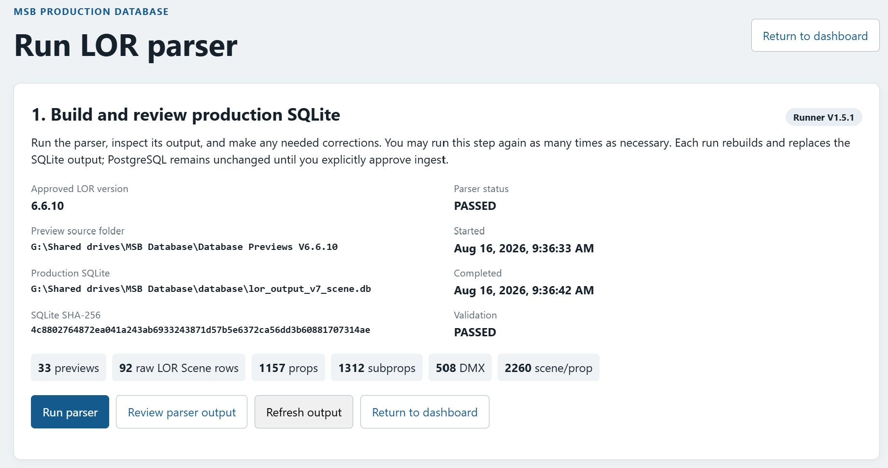
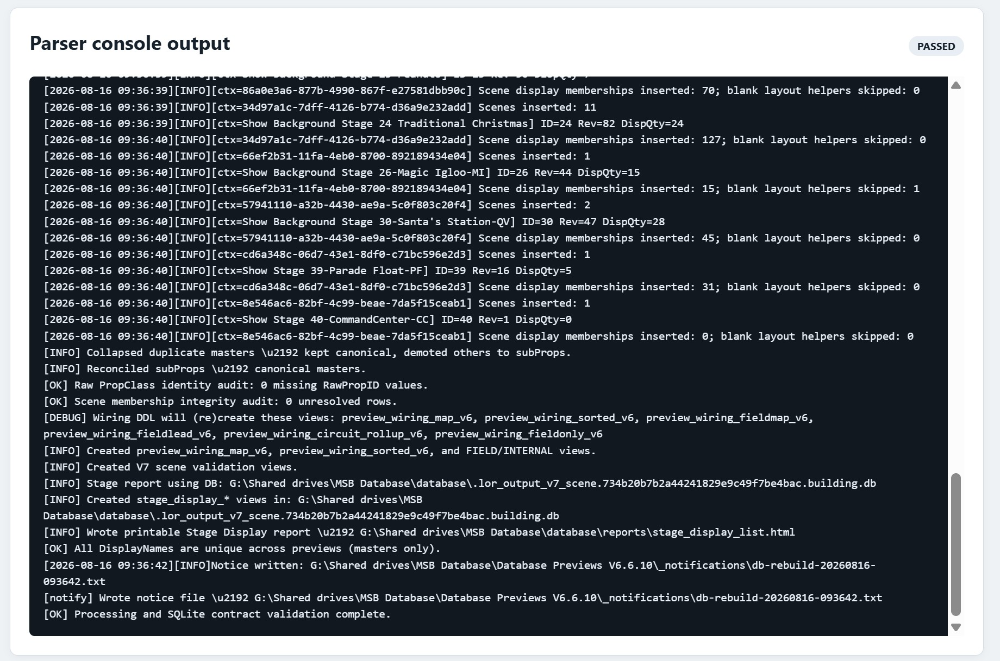

# LOR2DB Ingest

LOR2DB Ingest owns the controlled handoff from an approved V7 SQLite file into
the append-only PostgreSQL snapshot. The parser itself is owned by LOR Data
Extraction and is exposed here only for operator convenience through the
LOR2DB website.

In this documentation, **ingest** refers to the parser and import programs that prepare a snapshot for LOR2DB reconciliation.

## Start Here

The normal sequence is:

1. In LOR2DB, confirm **Current LOR version** and use **Run parser**.
2. Inspect the generated SQLite repeatedly as needed; parser runs never ingest.

3. Mark the exact displayed SQLite SHA-256 as ready for ingest only after its
   console, counts, reports, and data look correct.
4. Apply migration `0031_preserve_lor_sqlite_authority_chain.sql` before the
   first V0.4.0 ingest.
5. Use **Ingest to PostgreSQL** on the same page and review its console output.
6. Continue to [LOR2DB Reconciliation](../02_Reconciliation/README.md).

The ingest rejects a modified/replaced SQLite file and rejects any snapshot
that was not produced in `PRODUCTION` mode with `ValidationStatus=PASSED`.
V0.4.1 also makes retry recovery digest-idempotent: if the exact SQLite digest
was already committed, the existing completed `import_run_id` is returned and
no duplicate snapshot is created.

The exact engineering rules behind the parser are documented under [LOR Data Extraction](../../Docs/01_LOR_System/02_Data_Extraction/README.md). This README does not duplicate those rules.

## Files

| File | Purpose |
|---|---|
| `postgres_run_ingest_v7.ps1` | Operator entry point for the PostgreSQL ingest step |
| `postgres_ingest_from_lor_sqlite_v7.py` | Loads the parser output into the PostgreSQL snapshot schema |
| `requirements.txt` | Python dependencies required by the ingest programs |

## Related Systems

| System | Relationship |
|---|---|
| [LOR Data Extraction](../../Docs/01_LOR_System/02_Data_Extraction/README.md) | Engineering specifications for `.lorprev` structure, parser behavior, SQLite output, and LOR-version compatibility |
| [Preview Merger](../../Docs/01_LOR_System/03_Preview_Merger/README.md) | Protects the approved preview set before parsing |
| [LOR2DB Reconciliation](../02_Reconciliation/README.md) | Reviews the committed PostgreSQL snapshot and controls production promotion |
| [LOR2DB Reporting](../03_Reporting/README.md) | Publishes the permanent evidence for completed reconciliation runs |

## Related Documents

- [LOR Preview Parser Architecture](../../Docs/01_LOR_System/02_Data_Extraction/LOR_Preview_Parser_Architecture.md)
- [LOR Preview File Structure Specification](../../Docs/01_LOR_System/02_Data_Extraction/LOR_Preview_File_Structure_Specification.md)
- [LOR SQLite Output Database Structure](../../Docs/01_LOR_System/02_Data_Extraction/LOR_SQLite_Output_Database_Structure.md)
- [LOR Preview Version Compatibility Review](../../Docs/01_LOR_System/02_Data_Extraction/LOR_Preview_Version_Compatibility_Review.md)
