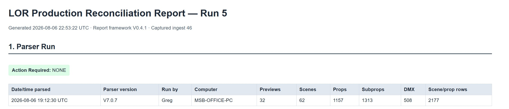
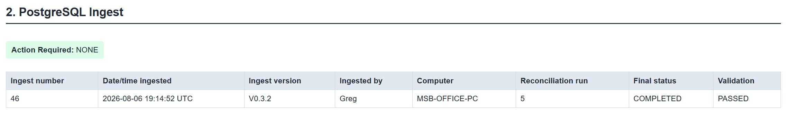
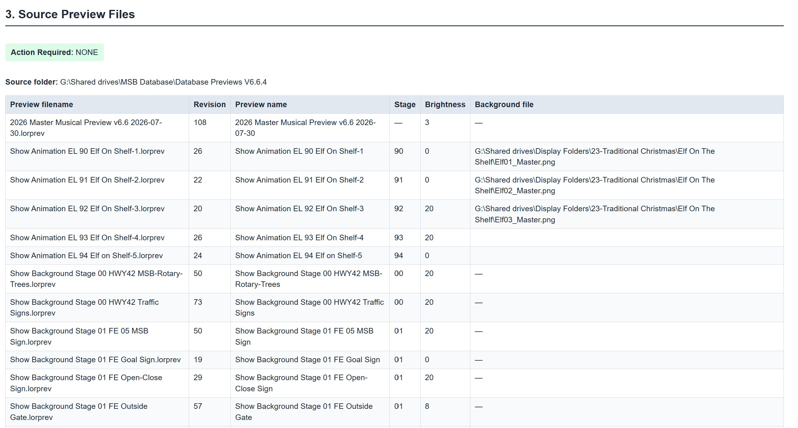
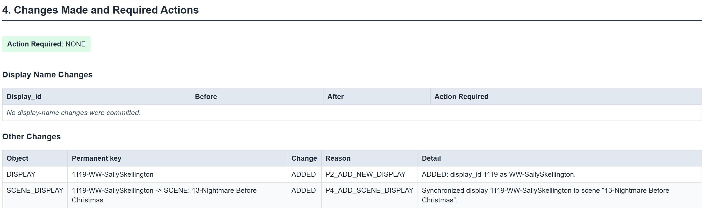
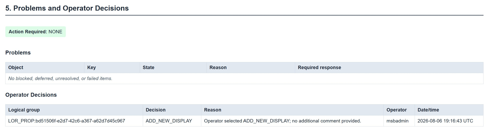
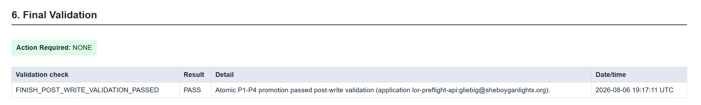

# LOR2DB Reporting

The LOR2DB Reporting subsystem provides permanent reconciliation reports for each completed production import and read-only audit reports used to compare current LOR information with related project records.

## Start Here

| I want to... | Go to |
|---|---|
| View the latest reconciliation report | [Open LOR2DB](https://my.sheboyganlights.org/lor2db/) and open the current report |
| Browse previous reconciliation reports | [Open the report archive](https://my.sheboyganlights.org/lor2db/reports/) |
| Check whether Google Drive Stage, Scene, and Display folders match current LOR | Run the [Google Drive alignment report](#google-drive-folder-alignment-report) on a Windows computer with the MSB Google Drive mounted |
| Understand the information contained in a reconciliation report | Review the report overview below |

Cloudflare authentication is required to access the LOR2DB application and published reconciliation report archive.

Report framework V0.6.1 lists every captured Scene-level background path,
sorts manifests and committed changes by natural Stage order (`05`, `05a`,
`06`, ...), and shows the exact frozen fields changed by automatic display
promotion. Evaluated no-op rows do not appear as production changes. The
publisher reads that evidence through the restricted operator-review view and
does not require direct access to internal candidate tables.

---

# Google Drive Folder Alignment Report

`generate_google_drive_alignment_report.py` is a **read-only Windows utility** used to compare the current LOR Stage/Scene/Display structure with the actual folders in the **Display Folders** Google Shared Drive.

This is a separate audit from production reconciliation. It does not update PostgreSQL and does not require starting a reconciliation run.

## What It Reads

By default, Version 1 reads:

```text
G:\Shared drives\MSB Database\database\lor_output_v7_scene.db
```

and compares that current V7 LOR SQLite snapshot with:

```text
G:\Shared drives\Display Folders
```

The utility uses the current LOR information to determine:

- Stage IDs;
- current LOR Scenes;
- Displays assigned to each Scene;
- Displays that belong directly to a Stage.

It then checks where the matching Stage, Scene, and Display folders are located on Google Drive.

## Safety

The alignment report is intentionally read-only.

It does **not**:

- create folders;
- move folders;
- rename folders;
- delete folders;
- modify the SQLite database;
- modify PostgreSQL.

Use the report to review the current state before making any Google Drive changes manually.

## Run It

Open the MSB Production Database repository in VS Code on a Windows computer where the Google Shared Drive is available as `G:`.

From the repository root, run:

```powershell
python .\LOR2DB\03_Reporting\generate_google_drive_alignment_report.py
```

No switches are required when the normal MSB `G:` paths are being used.

## Report Location

The default output folder is:

```text
G:\Shared drives\MSB Database\Database Previews V6.6.4\reports\google-drive-alignment
```

Each run creates two files with the same timestamp:

```text
lor-google-drive-alignment-YYYYMMDD-HHMMSS.html
lor-google-drive-alignment-YYYYMMDD-HHMMSS.csv
```

Open the HTML report for normal review. The CSV contains the same findings in a form that can be sorted or filtered.

## Report Statuses

| Status | Meaning |
|---|---|
| `MATCH` | The expected folder exists in the expected location. |
| `MISSING` | LOR expects the Stage, Scene, or Display but no matching folder was found. |
| `WRONG_LOCATION` | A matching folder exists, but it is not where the current LOR Stage/Scene structure places it. |
| `AMBIGUOUS` | More than one possible match exists, or one Display appears in more than one LOR Scene. Review manually. |
| `BLOCKED` | The Stage could not be resolved, so child folders could not be checked safely. |

Name matching is case-insensitive and ignores spaces and punctuation for comparison only. The utility never changes the actual folder names.

## Important Review Rule

Do not automatically move a folder because this report says `WRONG_LOCATION`.

The report identifies differences between the current LOR organization and Google Drive. Review the Stage, Scene, and Display before changing the permanent document repository, especially where older or historical folders are involved.

---

# Using the Reconciliation Report

The reconciliation report is the official record of each completed production reconciliation.

In addition to documenting the reconciliation process, it identifies the approved LOR preview source used for that production import and records the revision of every preview included in the reconciliation.

## Approved Preview Source



Section 3 of every reconciliation report identifies the **Source folder** used for that reconciliation.

Use this location whenever you need the current approved LOR preview files.

**Important**

- Import previews from the Source folder shown in the latest reconciliation report.
- Do **not** edit, overwrite, or save files in that folder.
- Make changes only in your own working copy.
- The Source folder contains the approved production preview set.

The Preview Merger system is currently under development. Until it becomes part of the production workflow, the latest reconciliation report remains the authoritative reference for the approved production preview source.

## Report Overview

The reconciliation report records the complete production reconciliation, including:

- Source preview information
- Imported preview revisions
- Reconciliation decisions
- Production changes
- Validation results
- Final reconciliation status

### Report Header



The report begins with a summary of the reconciliation run, source information, and overall completion status.

### Preview Revisions



This section lists the approved preview revisions that were included in the production reconciliation.

Use this information to verify that you are working from the current approved revision of a preview.

### Production Changes



Displays the approved production changes resulting from the reconciliation.

### Validation Results



Documents the validation checks completed before reconciliation was finalized.

### Completed Report



Each completed reconciliation report is retained as a permanent historical record and remains available through the report archive.

## Related LOR2DB Areas

- [LOR2DB Portal](../README.md)
- [Ingest](../01_Ingest/README.md)
- [Reconciliation](../02_Reconciliation/README.md)
- [Application](../Application/README.md)
- [Google Drive Folder Structure](../../Docs/00_Project_Overview/00-Google_Drive.md)
