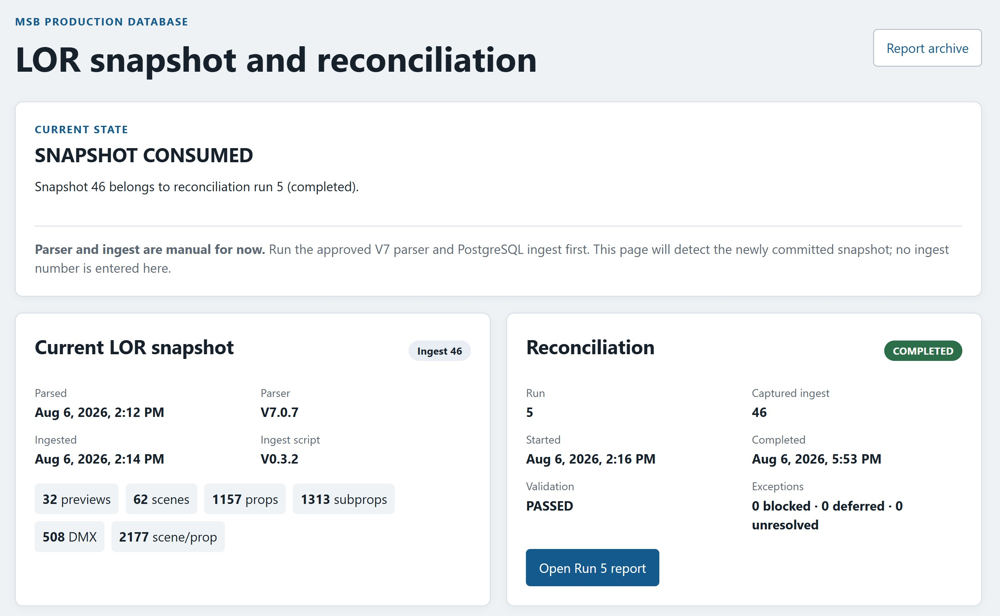

# LOR2DB

LOR2DB moves approved Light-O-Rama preview changes into the MSB production database through a controlled ingest, reconciliation, validation, and reporting process.

## Start Here

**Running the production workflow:** [Open LOR2DB](https://my.sheboyganlights.org/lor2db/)

Cloudflare authentication is required, just as it is for [my.sheboyganlights.org](https://my.sheboyganlights.org/).

The landing page separates the routine parser workflow, the infrequent LOR
version-approval workflow, and reconciliation status. Use **Run parser** for
normal preview changes. Use **Check new version** only when evaluating a
different Light-O-Rama software version. Use **Report archive** to view
completed and cancelled reconciliation reports, newest first.

**Completed reconciliation reports:** [Open the report archive](https://my.sheboyganlights.org/lor2db/reports/)

For production reconciliation procedures and recovery guidance, go to [Reconciliation](02_Reconciliation/README.md).

## What Do You Need To Do?

- [Run the repeatable parser, approve its output, and ingest it from the web interface](01_Ingest/README.md)
- [Run or understand reconciliation](02_Reconciliation/README.md)
- [Work on the LOR2DB application](Application/README.md)
- [Install, restart, recover, or transfer the LOR runner](Application/Office_PC_Runner_Operations_and_Disaster_Recovery.md)
- [View and understand reconciliation reports](03_Reporting/README.md)

## Folder Guide

| Folder | What it contains |
|---|---|
| [01_Ingest](01_Ingest/README.md) | PostgreSQL snapshot ingest and the handoff from the validated V7 SQLite file |
| [02_Reconciliation](02_Reconciliation/README.md) | Production reconciliation procedures, recovery guidance, and supporting engineering documentation |
| [03_Reporting](03_Reporting/README.md) | How to view, use, and understand production reconciliation reports |
| [Application](Application/README.md) | Engineering documentation for the LOR2DB browser application, secured API, deployment, and testing |

The detailed technical documentation remains in these subsystem folders. This README is only the LOR2DB navigation portal.
