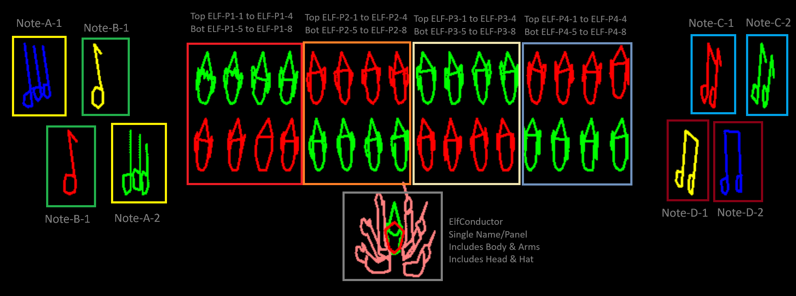
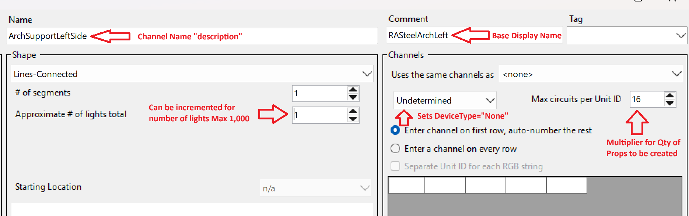

# Naming Conventions Updated 25-08-26

# Naming Conventions

We maintain **two distinct naming conventions** that must be followed consistently:

1. **Channel Naming Conventions** (used in LOR sequencing)
2. **Prop/Display Naming Conventions** (used for physical panels, database, and labels)

---

## 1. Channel Naming Conventions

The sequencing program sorts channels alphabetically. Therefore, it is imperative that props have **channel naming conventions** so they stay grouped in a predictable order in the preview. This is especially important for props with motion, where the order of channels must match the intended motion.

**Format:**

```
LL UID-Channel Name
```

- **LL** → Character abbreviation of the display or stage  
Prefixes like `EC` (Elf Choir), `WW` (Winter Wonderland), `PB` Polar Bears, etc indicate stage abbreviation for grouping/location
- **UID** → Assigned to the controller used  
- **Channel** → The channel/port of the controller  
- **Name** → A brief description of the channel name  

**Example:**  



`ELF-P1-01` Elf Pattern 1 1st Panel
`ELF-P1-02` Elf Pattern 1 2nd Panel
`ELF-P1-03` Elf Pattern 1 3rd Panel
`ELF-P4-16` Elf Pattern 4 16th Panel


⚠️ **Note:** If the UID or channel of a prop changes, the preview and all labeling must be updated. This has historically caused issues when UIDs were reassigned. NO EXISTING CHANNEL NAMES CAN BE CHANGED WITHOUT AUTHORIZATION!

---

## 2. Prop/Display Naming Conventions

Every display we build, set up, maintain, and store must have a **unique identifier**. This identifier:

- Appears on the physical label attached to the display.  
- Is duplicated in the **Comment** field within the LOR sequencing software.  
- Ensures every channel associated with a display can be traced back to the correct physical panel.  

### 2.1 Displays and Device Types

A **Display** is the complete physical panel or structure (e.g., Conductor, Elf, Note, Arch, Star).  
Every display is assigned a **Device Type** in the Preview, which determines how it is handled in the database.

**Device Types:**

> **Terminology note:** In the LOR Sequencing UI this appears as **Undetermined**.  
> In our parser and the SQLite database we record this as **DeviceType="None"**.

- **LOR**  
  - Props with channel grids assigned to LOR controllers.  
  - Master = lowest StartChannel, other legs become generated sub-props.  

- **DMX**  
  - Props controlled by DMX universes.  
  - Master metadata goes into `props`, each universe leg goes into `dmxChannels`.  

- **None** *(shown as **Undetermined** in the LOR UI)*  
  - Physical-only props with no channels (e.g., FTString-01R, cutouts, scenery).  
  - Stored in `props` with DeviceType="None".  
  - `MaxChannels` can act as a multiplier (e.g., 16 strings).  
  - Excluded from wiring views but included in inventory/labels.  

---

### 2.2 Display Naming Format

```
<DisplayName>-<Variation1-Variation2-etc.>-<Sequence>-<Color>
```
Variations are optional and used ONLY when needed to create Unique Display Names for tracking additional meta-data
- **DisplayName** → CamelCase (no spaces). Examples: `Elf`, `Note`, `CandyCane`, `MiniTree`.  
- **Variations** → Optional. Defines differences between props:  
  - **Pattern:** `P1`, `P2`, `A`, `B` …  When there are different patterns used to create each display like Elves in Elf Choir
  - **Location:** `DS`, `PS`, `LH`, `RH`, `Front`, `Rear`, `Section`, `Male`, `Female` 
  - **Section:** `A`, `B`, `C` …  When displays are setup in sections like Dancing Forest
- **Sequence*** → The instance number (for duplicates) of that variation.   
  - Always Pad single digits with leading zero (`01, 02, …, 10, 11, …`).  
  - ⚠️ *Do not use Sequence if Device Type is `None` (shown as **Undetermined** in the LOR UI). In that case, quantity is managed by **Max Circuits per Unit ID** instead.*  

- **Color** → Optional.  
  - Preferred: single-letter suffix appended to the sequence (`R`, `G`, `B`, `W`, `Y`).  
  - Alternate: full color names (e.g., `-Red`).

**Examples:**  
- Pattern-based: `Elf-P2-06`, `Note-B-01`  
- Color-based: `Star-Red-01`, `MiniTree-Green-04`  
- Location-based: `Arch-DS-01`, `Arch-PS-01`  
- Single-panel: `ElfConductor`  
- Stage/Section: `DFWrap-DS-A-01R`  
- Handed props: `SledPoof-LH-04`  
---
### 2.3 Single-Channel Displays

Many displays are a single channel (one lighting element). Each must have a unique identifier.

**Examples:**  

- **Elves (32 total, 4 patterns):**  
  - Pattern 1: `Elf-P1-01` … `Elf-P1-08`  
  - Pattern 2: `Elf-P2-01` … `Elf-P2-08`  
  - Pattern 3: `Elf-P3-01` … `Elf-P3-08`  
  - Pattern 4: `Elf-P4-01` … `Elf-P4-0`  

- **Notes (8 total, 4 patterns):**  
  - `Note-A-01`, `Note-A-02`  
  - `Note-B-01`, `Note-B-02`  
  - `Note-C-01`, `Note-C-02`  
  - `Note-D-01`, `Note-D-02`  

### 2.4 Multi-Channel Grid Displays

These types of displays include things like a Spiral Tree, MiniTree, Light Curtain. These are single display but use multiple channels on a single display. We also configure some props using a light curtain that makes sequencing easier.

**Examples:**  
  - `SpiralTreeGrn`
  - `SpiralTreeRed`
  - `SpiralTreeMC`
  - `Pinwheel-PS`
  - `Pinwheel-DS`

---

### 2.5 Sub-Props

There are **two kinds of sub-props** we must distinguish:

#### Generated Sub-Props (Database / Parser)
- Created when a single physical display has multiple channels.  
- Generated automatically by the parser.  
- Always belong to one display and share its Display Name.
- Uses the `Comment` field in the sequencer to apply the `Display_Name` to build the Sub-Props.
- Preserves the `Channel_Name` for the wiring.

**Examples:**
`ElfConductor` → EC Cond LH 1 L28-09, EC Cond LH 2 L28-10, EC Cond LH 3 L28-11, EC Cond RH 3 L28-12, EC Cond RH 2 L28-13, EC Cond RH 1 L28-14, EC Cond L28-15, EC Cond Head Bob
`WhoPanel-01` →  Whos Body 16, Whos Head Left-16, Whos Head Mid-16, Whos Head Right-16, Whos Hand 16 Inside Dn, Whos Hand 16 Inside Mid, Whos Hand 16 Inside Up, Whos Body 15, Whos Head Mid-15, Whos Hand 15 Outside Dn, Whos Hand 15 Outside Mid, Whos Hand 15 Outside Up, Whos Head Left-15, Whos Head Right-15

#### Manual assigned Sub-Props (Sequencing Software)
- Created inside the LOR sequencing software by selecting **"Uses same channel as"**.  
- Can span across multiple displays (aliases) OR can exist on the same display.  
- Manual assigned Sub-Props do not create new physical channels; they reference existing ones in the sequencer.  

**Examples:** 
- Sub-Props within the same Panel to create more detail needed to describe the display
`TC 7B 01-06 Hippo` uses the base channel `TC 7B-04 Body Mid`→ and adds these to it: TC 7B-04 Mid Body Eyes, TC 7B-04 Mid Body Nose, TC 7B-04 Mid Body Lid, TC 7B-04 Mid Body Bow, TC 7B-03 Lid Open Bow Top, TC 7B-03 Lid Open Bow Bot
- Sub-Props across multiple displays to share the same channels and effects.
`Pigpen` PN PP 79-09 Body → PN SL 79-09 Schroeder Body, PN SL 79-09 Lucy Head, PN SL 79-01 Lucy Body Leg, PN SL 79-01 Lucy Body Dress

---

### 2.6 Display Type = None

Some props do not have channels (DeviceType="None").



- **Purpose:** Exists in Preview for setup, labeling, and inventory; no channel mapping.  
- **Examples:** `FTString-01R`, static cutouts, scenery.  
- **Database Handling:**  
  - Still follow the naming convention.  
  - `MaxChannels` may act as a multiplier (e.g., 16 strings).  
  - Stored in `props` with metadata (Name, Comment, Lights).  

### 2.7 Inventory Data (Metadata)

This information is currently stored in a spreadsheet that will be migrated to an inventory table. This is needed information that is not provided by the LOR sequencing software. Some of the metadata includes: 

- Designer  
- Year Built  
- Number of Lights  
- Number of Amps
- Pallet_ID
- Theme
- Other metadata  

---

✅ By maintaining **both channel and display naming conventions**, we ensure consistency across:
- Physical assets (labels)  
- LOR software (comments)  
- Database (props, inventory, wiring)  
